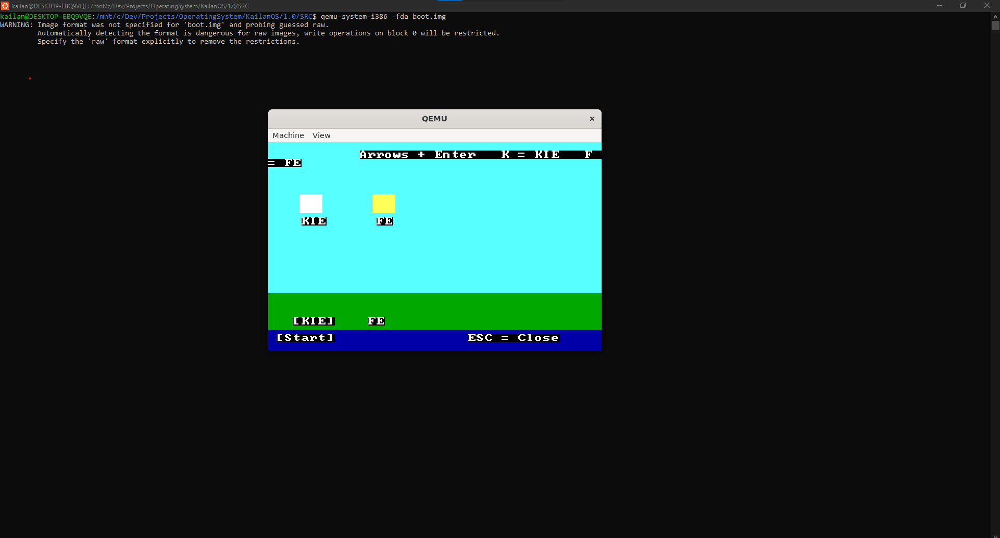

## ⚠️ Warning

This operating system uses **BIOS (Legacy Boot)** and does **not support UEFI**.

Make sure you run it on:
- An older computer with BIOS support, or  
- A system with **CSM (Compatibility Support Module)** / Legacy Boot enabled, or  
- An emulator like **QEMU** (recommended)

# KailanOS-XP-1.1 (NEW VERSION YEHAW!!!)
Welcome to KailanOS XP with 2 apps KIE (stands for Kailan Internet Explorer) and FE (stands for File Explorer) and i will update KIE to display more pages and now enjoy!
and check the release at: https://github.com/kailanrt9-ui/KailanOS-XP-1.0/releases and then look for 1.1 now proof is
## Screenshot

